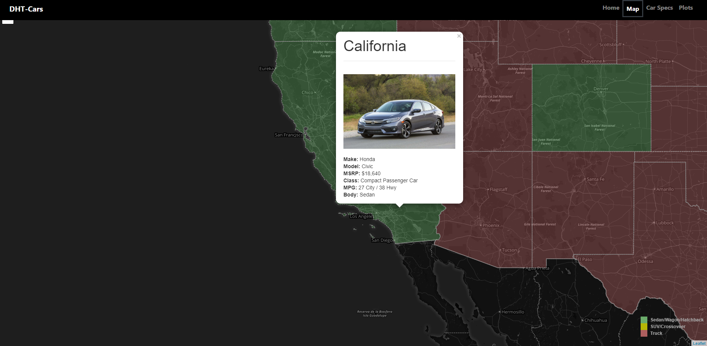

# Most Popular Vehicle by State 2016

### [Web App](https://dht-cars.herokuapp.com/)

A web-scraping application that uses Flask, SQLAlchemy, and Leaflet.js to extract information about the most popular car in each state and present the data using an interactive map, charts. HTML, CSS, and JavaScript are used to build an interactive dashboard to visualize the extracted data.

* [USA Today article](https://www.usatoday.com/story/news/nation-now/2017/08/30/these-most-popular-cars-and-trucks-every-state/478537001/) used for initial scraping.
* [Motortrend](https://www.motortrend.com) and [KBB](https://www.kbb.com) were scrapped for more information on the vehicles.
* State colors on the map correspond to vehicle body type and clicking a state will displa a pop-up with vehicle information.
* Graphs are used to show the vehicle value depreciation as well as popularity of each make, model, and body type.

- - -